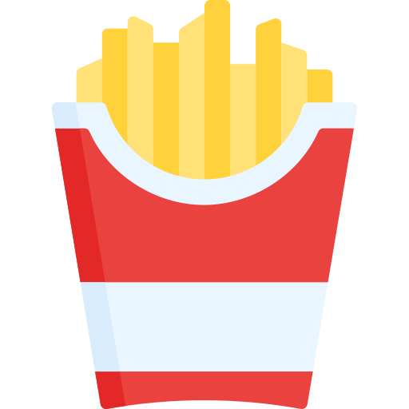
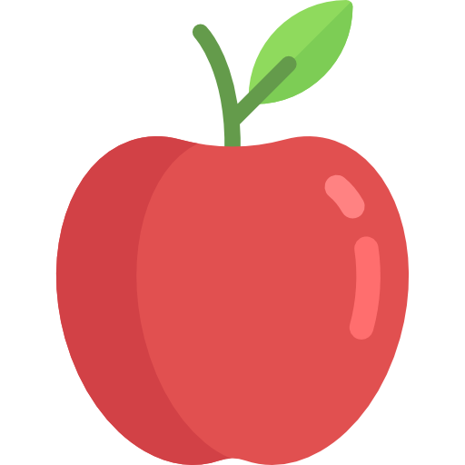
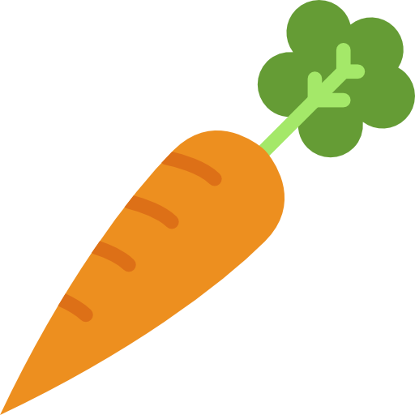

<head>
    <meta charset="utf-8">  
    <title>Food Memory Game</title>
    <meta name="viewport" content="width=device-width, initial-scale=1.0">
    
</head>
<body>
    

        <ul class="cards">
        <li class="card">
            

            
            

            

            
            

        </li>
        <li class="card">
            

            
            

            

            
            

        </li>
        <li class="card">
            

            
            

            

            
            

        </li>
        <li class="card">
            

            
            

            

            
            

        </li>
        <li class="card">
            

            
            

            

            
            

        </li>
        <li class="card">
            

            
            

            

            
            

        </li>
        <li class="card">
            

            
            

            

            
            

        </li>
        <li class="card">
            

            
            

            

            
            

        </li>
        <li class="card">
            

            
            

            

            
            

        </li>
        <li class="card">
            

            
            

            

            
            

        </li>
        <li class="card">
            

            
            

            

            
            

        </li>
        <li class="card">
            

            
            

            

            
            

        </li>
        

            
Time: <b>20</b>s

            
Flips: <b>0</b>

            <button>Refresh</button>
        

        </ul>
    

</body>

